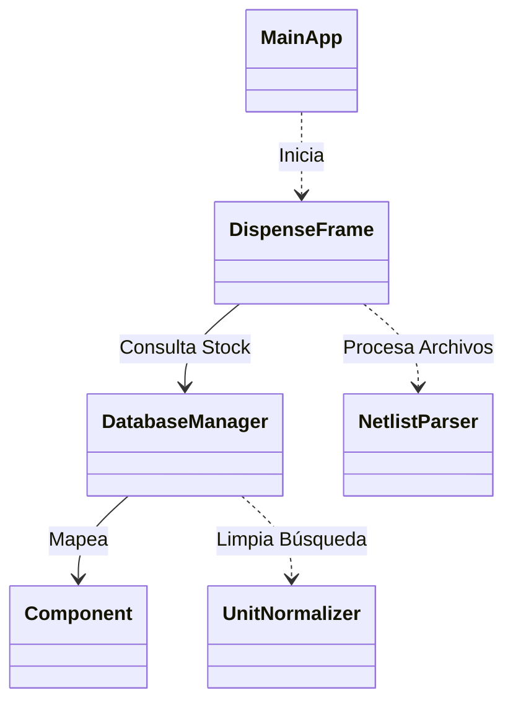

# 🗄️ Armario Inteligente - Sistema de Dispensación

Este proyecto es una aplicación de escritorio en Java (Swing) diseñada para gestionar el inventario y la dispensación automatizada de componentes electrónicos en un "Armario Inteligente". 

El sistema permite visualizar el stock, buscar componentes de forma inteligente y procesar listas de materiales (Netlists) mediante "Drag & Drop".

## 🏗️ Arquitectura del Proyecto

El código está organizado siguiendo una separación lógica de responsabilidades. A continuación se detalla la función de cada clase:

### 🖥️ Capa de Presentación (UI)

#### `MainApp.java`
* **Rol:** Punto de entrada (Entry Point).
* **Función:** Inicia el hilo de despacho de eventos de Swing (`EDT`) y lanza la ventana principal `DispenseFrame`.

#### `DispenseFrame.java`
* **Rol:** Interfaz Gráfica de Usuario (GUI).
* **Función:** Es el núcleo visual de la aplicación.
    * **Gestión Visual:** Divide la pantalla en **Inventario** (izquierda) y **Carrito de Dispensación** (derecha).
    * **Interacción:** Maneja eventos de ratón (doble clic para añadir componentes) y actualiza las tablas en tiempo real.
    * **Drag & Drop:** Implementa un `DropTarget` que permite arrastrar archivos `.txt`, `.cir` o `.net` directamente a la ventana para cargar listas de componentes automáticamente.
    * **Lógica de Carrito:** Contiene la clase interna `CartItem` para gestionar las cantidades solicitadas antes de confirmar la dispensación.

---

### 💽 Capa de Datos (Persistencia)

#### `DatabaseManager.java`
* **Rol:** Gestor de Base de Datos (DAO / Singleton).
* **Función:** Centraliza la comunicación con **SQLite**.
    * **Patrón Singleton:** Asegura que solo exista una conexión abierta a la base de datos.
    * **Búsqueda Inteligente:** El método `findComponent` utiliza consultas SQL tolerantes a fallos (ignora mayúsculas, espacios y símbolos como 'Ω' o 'µ') para encontrar componentes aunque el usuario no escriba el nombre exacto.
    * **Transacciones:** Maneja la actualización segura del stock (`dispenseComponent`), restando cantidades solo si hay disponibilidad suficiente.

#### `Component.java`
* **Rol:** Modelo de Datos (POJO).
* **Función:** Representa la estructura de un componente electrónico tal como existe en la base de datos.
    * Almacena atributos como: `ID`, `Tipo` (Resistencia, Condensador...), `Valor`, `Stock`, `Ubicación`, `Foto` y `Categoría`.

---

### 🛠️ Utilidades y Parsers

#### `NetlistParser.java`
* **Rol:** Procesador de Archivos.
* **Función:** Interpreta archivos de listas de redes (Netlists) generados por software de simulación (como SPICE).
    * Lee el archivo línea por línea.
    * Ignora comentarios y comandos de simulación.
    * Extrae pares de **Tipo** y **Valor** (ej. detecta que `R1 10k` es una Resistencia de 10k) para añadirlos automáticamente al carrito de dispensación.

#### `UnitNormalizer.java`
* **Rol:** Normalización de Unidades.
* **Función:** Ayuda a estandarizar los valores de los componentes electrónicos para las búsquedas y conversiones.
    * `cleanForSearch()`: Elimina símbolos complejos (Ω, µ, F, H) para facilitar las consultas SQL.
    * `normalize()`: (Opcional) Convierte valores con sufijos de ingeniería (k, M, u, n, p) a sus valores numéricos estándar.

---

## ⚙️ Configuración Importante

⚠️ **Nota sobre la Base de Datos:**
Actualmente, la ruta de la base de datos está definida estáticamente en `DatabaseManager.java`. Para ejecutar este proyecto en tu máquina local, debes modificar la siguiente línea:

```java
// En DatabaseManager.java
String dbPath = "TU_RUTA_LOCAL/inventario.db";
```
##📦 Dependencias
Java JDK 8+

SQLite JDBC Driver (necesario para conectar DatabaseManager con el archivo .db).

##📊 Diagrama de Clases

